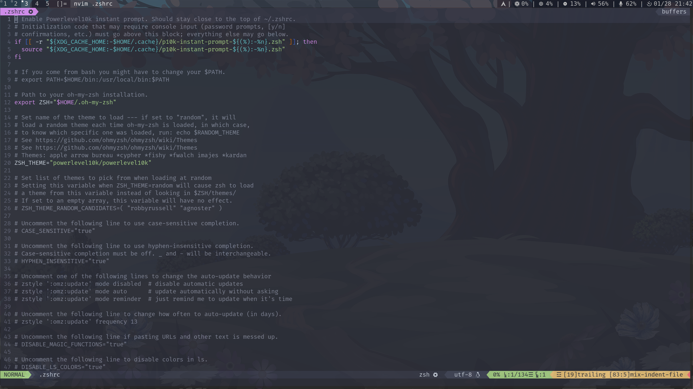

# Archlinux DWM

#### 软件

+ dwm
+ dmenu
+ slstatus
+ slock
+ st
+ alacritty
+ rofi
+ konsole
+ nitrogen
+ picom-ftglabs-git(aur)
+ ranger
	1. install ueberzug
	2. (/.config/rc.config)
		set preview_images true
		set preview_images_method ueberzug

#### 截图

